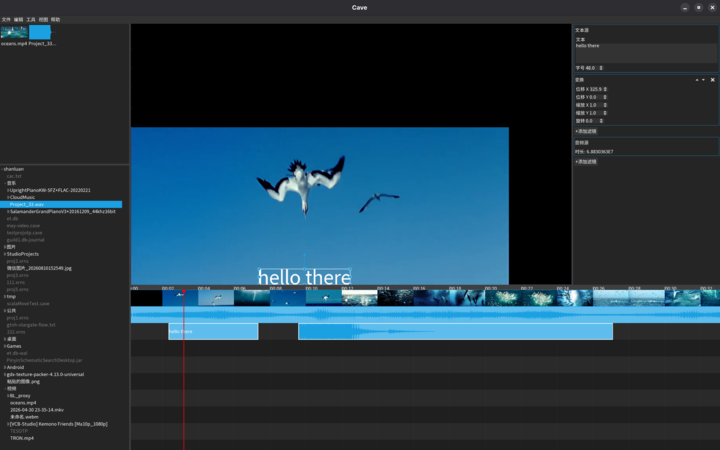
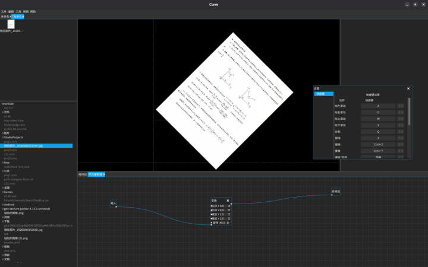

# Cave — CAVE's Another Video Editor

English | [简体中文](README.md)

## What is this thing?
A video editor built on Scala 3. Or an effects tool. Or a DAW. Who cares?

## Architecture & Features
- Almost everything is a node. Every modification is done by appending or in-place editing nodes (the UI does this automatically).
- Persistent, immutable timeline. Complete with functional buzzwords. For instance, a track is a bijection between a sum-type ADT of Gap and Segment elements and half-open intervals.
- An extremely extensible architecture. If I wanted to, I could easily plug in OSU!lazer objects, G-code, MIDI, or SRT subtitles.
- Cross-platform. Windows, Mac, Linux, Android (note: the Android branch builds, but no UI adaptation has been added).
- Tabbed multi-project. Copying between projects is WIP.
- A task system reserved for time-consuming jobs. Currently only the export task is implemented. You can export video without blocking your editing.
- Powerful codec support courtesy of JavaCV (FFmpeg). Handles roughly a hundred video formats.
- GPU rendering courtesy of libgdx.
- A Scene2D-based UI, the same one Spine uses. Forget CEF!
- Completely free software.

## License

GNU Affero General Public License v3.0
