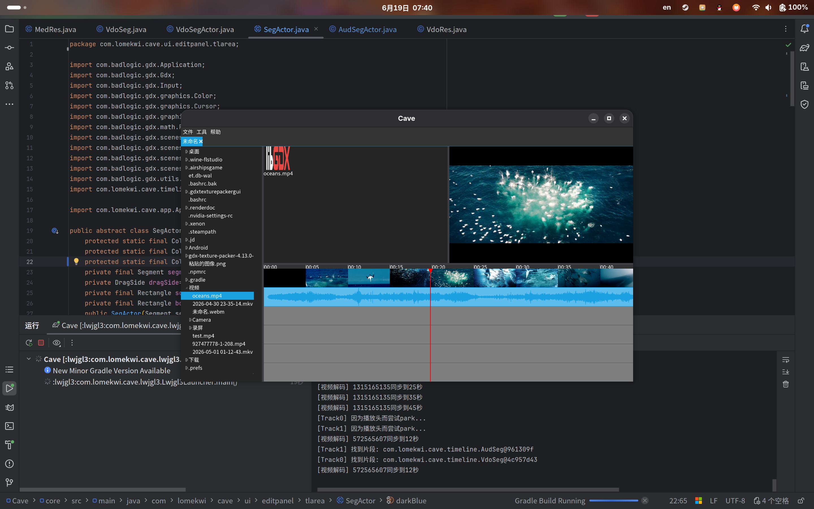

# Cave — CAVE's Another Video Editor



> **开发中，不可用于生产环境。**

## 简介

Cave 是一个跨平台非线性视频编辑器，目标平台为桌面端（Linux / Windows / macOS）和 Android。使用 libGDX 负责渲染与 UI，JavaCV（FFmpeg）负责媒体解码与编码导出。

## 技术栈

| 用途      | 库                          |
|---------|----------------------------|
| UI / 渲染 | libGDX                     |
| 媒体编解码  | JavaCV / FFmpeg (Bytedeco) |
| 事件总线    | Guava EventBus             |
| UI 组件   | VisUI                      |

## 模块结构

```
core/      平台无关的应用逻辑与 UI
lwjgl3/    桌面启动器（Linux / Windows / macOS）
android/   Android 启动器
```

## 当前状态

| 功能         | 状态          |
|------------|-------------|
| 视频播放       | 可用          |
| 多轨编辑（增删移改） | 可用          |
| 项目保存 / 加载  | 可用          |
| 视频导出       | 可用（MP4 封装，H.264 编码） |
| Android 构建 | 可编译，未在设备上测试 |
| 音频支持       | 基础播放与导出    |
| 效果 / 滤镜    | 未实现         |
| 撤销 / 重做    | 未实现         |

## 许可证

GNU Affero General Public License v3.0
